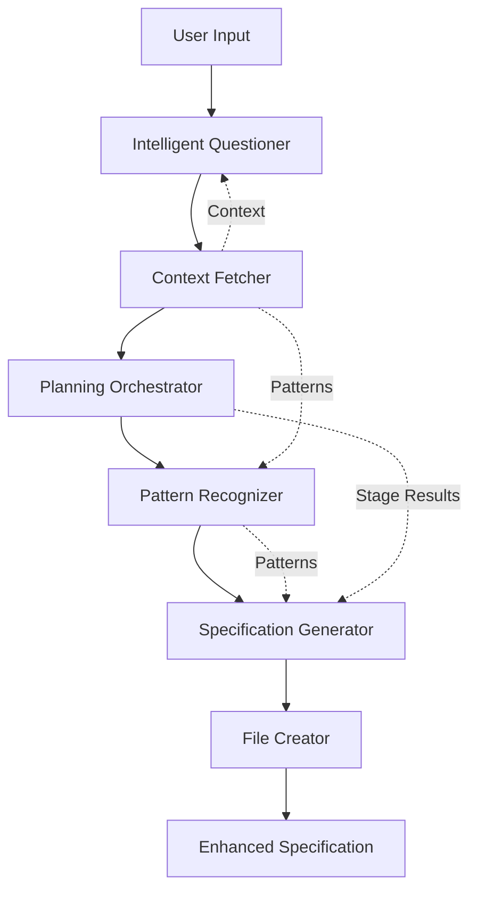

# Agent Integration Specifications

## Overview

This document specifies how the enhanced planning algorithms integrate with existing Agent OS agents and how new specialized agents extend the planning capabilities.

## Existing Agent Enhancements

### 1. Context-Fetcher Agent Enhancement

```typescript
interface EnhancedContextFetcher extends ContextFetcher {
  // New capabilities
  analyzeDomain(input: string): DomainType
  extractPatterns(specs: Specification[]): Pattern[]
  findSimilarProjects(context: ProjectContext): Project[]
  assessCompleteness(data: any): CompletenessScore
}

class EnhancedContextFetcherAgent {
  async fetchWithIntelligence(request: ContextRequest): Promise<EnhancedContext> {
    // Original fetching
    const baseContext = await this.fetchContext(request)

    // Enhanced analysis
    const domain = this.analyzeDomain(baseContext)
    const patterns = this.extractPatterns(baseContext)
    const similar = await this.findSimilarProjects(baseContext)

    return {
      ...baseContext,
      domain,
      patterns,
      similarProjects: similar,
      completeness: this.assessCompleteness(baseContext)
    }
  }

  private analyzeDomain(context: any): DomainType {
    const keywords = this.extractKeywords(context)
    const scores = new Map<DomainType, number>()

    for (const [domain, config] of this.domainConfigs) {
      const score = this.calculateDomainScore(keywords, config.keywords)
      scores.set(domain, score)
    }

    return this.getHighestScoringDomain(scores)
  }
}
```

### 2. File-Creator Agent Enhancement

```typescript
interface EnhancedFileCreator extends FileCreator {
  // New capabilities
  createAdaptiveStructure(spec: AdaptiveSpec): FileStructure
  generateIntelligentContent(template: Template, context: Context): Content
  validateFileCompleteness(file: File): ValidationResult
}

class EnhancedFileCreatorAgent {
  async createWithIntelligence(request: FileRequest): Promise<FileResult> {
    // Determine optimal structure
    const structure = this.determineStructure(request.context)

    // Generate adaptive content
    const content = await this.generateAdaptiveContent(
      request.template,
      request.context
    )

    // Create with validation
    const result = await this.createFile({
      ...request,
      content,
      structure
    })

    // Validate completeness
    const validation = this.validateFileCompleteness(result)

    if (!validation.isValid) {
      return this.enhanceFile(result, validation.suggestions)
    }

    return result
  }
}
```

### 3. Project-Manager Agent Enhancement

```typescript
interface EnhancedProjectManager extends ProjectManager {
  // New capabilities
  orchestratePlanning(mode: PlanningMode): PlanningResult
  trackPlanningProgress(stage: PlanningStage): Progress
  coordinateAgents(task: Task): AgentCoordination
  optimizePlanExecution(plan: Plan): OptimizedPlan
}

class EnhancedProjectManagerAgent {
  async managePlanning(request: PlanningRequest): Promise<PlanningResult> {
    // Select planning mode
    const mode = this.selectPlanningMode(request.complexity)

    // Initialize planning stages
    const stages = this.initializeStages(mode)

    // Execute stages with coordination
    for (const stage of stages) {
      await this.executeStage(stage)
      this.trackProgress(stage)

      if (stage.requiresValidation) {
        await this.validateStage(stage)
      }
    }

    // Optimize final plan
    const plan = this.assemblePlan(stages)
    return this.optimizePlan(plan)
  }
}
```

## New Specialized Agents

### 1. Intelligent Questioner Agent

```yaml
---
name: intelligent-questioner
description: Generates and manages adaptive, context-aware questions for requirement gathering
tools: Context Analysis, Question Generation, Answer Processing
color: purple
---

Core Responsibilities:
- Analyze project context to determine question strategy
- Generate domain-specific questions
- Adapt questions based on previous answers
- Track question-answer pairs for learning
- Identify information gaps

Workflow:
1. Receive initial project context
2. Classify domain and complexity
3. Generate initial question set
4. Present questions in priority order
5. Process answers and adapt
6. Continue until sufficient information
7. Summarize gathered requirements

Output Format:
- Questions presented with context
- Follow-up questions based on answers
- Completeness assessment
- Requirement summary
```

```typescript
class IntelligentQuestionerAgent {
  private questionEngine: QuestionEngine
  private domainClassifier: DomainClassifier
  private answerProcessor: AnswerProcessor

  async gatherRequirements(context: ProjectContext): Promise<Requirements> {
    // Classify domain
    const domain = await this.domainClassifier.classify(context)

    // Initialize question session
    const session = this.questionEngine.createSession(domain, context)

    // Adaptive questioning loop
    while (!session.isComplete()) {
      const question = session.getNextQuestion()
      const answer = await this.askUser(question)

      session.processAnswer(answer)

      // Generate follow-ups if needed
      const followUps = this.generateFollowUps(answer, context)
      session.addQuestions(followUps)
    }

    // Compile requirements
    return this.compileRequirements(session)
  }
}
```

### 2. Planning Orchestrator Agent

```yaml
---
name: planning-orchestrator
description: Orchestrates multi-stage planning process with intelligent stage transitions
tools: Stage Management, Progress Tracking, Validation
color: blue
---

Core Responsibilities:
- Execute multi-stage planning process
- Manage stage transitions
- Coordinate between planning stages
- Validate stage outputs
- Optimize planning flow

Workflow:
1. Determine planning mode based on complexity
2. Initialize appropriate stages
3. Execute each stage with validation
4. Track progress and dependencies
5. Handle stage transitions
6. Optimize final plan
7. Generate execution roadmap
```

```typescript
class PlanningOrchestratorAgent {
  private stageManager: StageManager
  private validator: StageValidator
  private optimizer: PlanOptimizer

  async orchestratePlanning(request: PlanningRequest): Promise<Plan> {
    // Select mode
    const mode = this.selectMode(request)

    // Execute stages
    const stageResults = []
    for (const stage of mode.stages) {
      const result = await this.executeStage(stage, request)

      // Validate before proceeding
      const validation = await this.validator.validate(result)
      if (!validation.passed) {
        result = await this.remediate(result, validation)
      }

      stageResults.push(result)

      // Check if we should iterate
      if (this.shouldIterate(result, stage)) {
        await this.iterateStage(stage, result)
      }
    }

    // Optimize and return
    return this.optimizer.optimize(stageResults)
  }
}
```

### 3. Specification Generator Agent

```yaml
---
name: specification-generator
description: Generates adaptive, intelligent specifications based on context
tools: Template Selection, Content Generation, Enhancement
color: green
---

Core Responsibilities:
- Select optimal specification template
- Generate adaptive content
- Infer missing requirements
- Apply domain patterns
- Enhance with best practices
- Validate completeness

Workflow:
1. Analyze context and requirements
2. Select appropriate template
3. Generate base sections
4. Enrich with domain knowledge
5. Add inferred requirements
6. Apply patterns and standards
7. Validate and enhance
8. Generate final specification
```

```typescript
class SpecificationGeneratorAgent {
  private templateEngine: TemplateEngine
  private contentGenerator: ContentGenerator
  private enhancer: SpecificationEnhancer
  private validator: SpecificationValidator

  async generateSpecification(context: SpecContext): Promise<Specification> {
    // Select template
    const template = await this.templateEngine.selectTemplate(context)

    // Generate base content
    let spec = await this.contentGenerator.generate(template, context)

    // Enhance with intelligence
    spec = await this.enhancer.enhance(spec, {
      addInferredRequirements: true,
      applyDomainPatterns: true,
      enrichWithBestPractices: true,
      generateExamples: true
    })

    // Validate
    const validation = await this.validator.validate(spec)

    if (validation.score < 0.8) {
      spec = await this.improveSpecification(spec, validation)
    }

    return spec
  }
}
```

### 4. Pattern Recognition Agent

```yaml
---
name: pattern-recognizer
description: Identifies and applies patterns from organizational knowledge
tools: Pattern Analysis, Similarity Search, Pattern Application
color: orange
---

Core Responsibilities:
- Identify patterns in existing specifications
- Find similar projects
- Extract best practices
- Apply proven patterns
- Learn from feedback

Workflow:
1. Analyze current context
2. Search for similar projects
3. Extract successful patterns
4. Evaluate pattern applicability
5. Suggest pattern applications
6. Track pattern effectiveness
```

```typescript
class PatternRecognitionAgent {
  private patternDatabase: PatternDatabase
  private similarityEngine: SimilarityEngine
  private patternApplicator: PatternApplicator

  async findAndApplyPatterns(context: ProjectContext): Promise<AppliedPatterns> {
    // Find similar projects
    const similar = await this.similarityEngine.findSimilar(context)

    // Extract patterns
    const patterns = await this.extractPatterns(similar)

    // Evaluate applicability
    const applicable = this.evaluatePatterns(patterns, context)

    // Apply patterns
    const applied = await this.patternApplicator.apply(applicable, context)

    // Track for learning
    this.trackPatternUsage(applied)

    return applied
  }
}
```

## Agent Communication Protocol

```typescript
interface AgentMessage {
  from: AgentId
  to: AgentId
  type: MessageType
  payload: any
  timestamp: number
  correlationId: string
}

interface AgentCoordinator {
  sendMessage(message: AgentMessage): Promise<void>
  receiveMessage(agentId: AgentId): Promise<AgentMessage>
  broadcastToAgents(message: AgentMessage, agents: AgentId[]): Promise<void>
  waitForResponses(correlationId: string, timeout: number): Promise<AgentMessage[]>
}

class EnhancedAgentCoordinator implements AgentCoordinator {
  private messageQueue: MessageQueue
  private agentRegistry: AgentRegistry

  async coordinatePlanning(request: PlanningRequest): Promise<PlanningResult> {
    // Initialize planning session
    const sessionId = this.createSession()

    // Broadcast planning initiation
    await this.broadcastToAgents({
      type: 'PLANNING_INITIATED',
      payload: { request, sessionId }
    }, ['questioner', 'orchestrator', 'generator'])

    // Coordinate stages
    const stages = ['questioning', 'planning', 'specification', 'validation']

    for (const stage of stages) {
      const agent = this.getAgentForStage(stage)
      const result = await this.executeAgentStage(agent, stage, sessionId)

      // Share results with other agents
      await this.shareStageResults(result, sessionId)
    }

    // Compile final result
    return this.compilePlanningResult(sessionId)
  }
}
```

## Agent Capability Matrix

```yaml
agent_capabilities:
  context_fetcher:
    original:
      - fetch_files
      - search_content
      - retrieve_context
    enhanced:
      - domain_analysis
      - pattern_extraction
      - similarity_search
      - completeness_assessment

  file_creator:
    original:
      - create_files
      - create_directories
      - write_content
    enhanced:
      - adaptive_structure
      - intelligent_content
      - validation
      - enhancement

  project_manager:
    original:
      - manage_tasks
      - track_progress
      - coordinate_work
    enhanced:
      - planning_orchestration
      - stage_management
      - agent_coordination
      - plan_optimization

  intelligent_questioner:
    new:
      - adaptive_questioning
      - domain_classification
      - answer_processing
      - requirement_inference

  planning_orchestrator:
    new:
      - stage_execution
      - mode_selection
      - validation_management
      - iteration_control

  specification_generator:
    new:
      - template_selection
      - content_generation
      - requirement_inference
      - pattern_application

  pattern_recognizer:
    new:
      - pattern_identification
      - similarity_analysis
      - best_practice_extraction
      - pattern_application
```

## Integration Points

### 1. Command Integration

```typescript
// Enhanced /plan-product command
class EnhancedPlanProductCommand {
  async execute(input: string): Promise<void> {
    // Use intelligent questioner
    const requirements = await this.questionerAgent.gatherRequirements(input)

    // Use planning orchestrator
    const plan = await this.orchestratorAgent.orchestratePlanning(requirements)

    // Use specification generator
    const spec = await this.generatorAgent.generateSpecification(plan)

    // Use file creator with enhancements
    await this.fileCreatorAgent.createWithIntelligence(spec)
  }
}

// New /enhance-spec command
class EnhanceSpecCommand {
  async execute(specPath: string): Promise<void> {
    // Read existing spec
    const spec = await this.contextFetcher.fetchSpec(specPath)

    // Analyze and enhance
    const enhanced = await this.specGenerator.enhance(spec)

    // Apply patterns
    const withPatterns = await this.patternRecognizer.applyPatterns(enhanced)

    // Save enhanced version
    await this.fileCreator.saveEnhancedSpec(withPatterns)
  }
}
```

### 2. Workflow Integration

```yaml
enhanced_workflows:
  planning_workflow:
    steps:
      - agent: intelligent_questioner
        action: gather_requirements
      - agent: context_fetcher
        action: retrieve_organizational_context
      - agent: planning_orchestrator
        action: execute_planning_stages
      - agent: pattern_recognizer
        action: identify_applicable_patterns
      - agent: specification_generator
        action: generate_adaptive_spec
      - agent: file_creator
        action: create_spec_structure

  specification_workflow:
    steps:
      - agent: context_fetcher
        action: analyze_context
      - agent: intelligent_questioner
        action: clarify_requirements
      - agent: pattern_recognizer
        action: find_similar_projects
      - agent: specification_generator
        action: generate_specification
      - agent: file_creator
        action: save_specification
```

### 3. Data Flow Integration



## Performance Optimization

```typescript
interface AgentPerformanceMetrics {
  responseTime: number
  accuracy: number
  completeness: number
  userSatisfaction: number
}

class AgentPerformanceOptimizer {
  optimizeAgentChain(agents: Agent[]): OptimizedChain {
    // Parallel execution where possible
    const parallelizable = this.identifyParallelizable(agents)

    // Cache frequent operations
    const cacheable = this.identifyCacheable(agents)

    // Optimize data transfer
    const optimizedTransfer = this.optimizeDataTransfer(agents)

    return {
      parallelizable,
      cacheable,
      optimizedTransfer
    }
  }
}
```

## Error Handling and Recovery

```typescript
interface AgentErrorHandler {
  handleError(error: AgentError): ErrorRecovery
  retryWithFallback(agent: Agent, error: Error): Promise<any>
  escalateToUser(error: Error, context: Context): UserEscalation
}

class EnhancedErrorHandler implements AgentErrorHandler {
  async handleAgentFailure(agent: Agent, error: Error): Promise<Recovery> {
    // Try automatic recovery
    if (this.canRecover(error)) {
      return await this.attemptRecovery(agent, error)
    }

    // Try fallback agent
    if (this.hasFallback(agent)) {
      return await this.useFallbackAgent(agent, error)
    }

    // Escalate to user
    return await this.escalateToUser(error, agent.context)
  }
}
```

## Testing and Validation

```typescript
class AgentIntegrationTester {
  async testEnhancedPlanning(): Promise<TestResult> {
    const scenarios = [
      'simple_project',
      'complex_fintech',
      'ecommerce_platform',
      'saas_application'
    ]

    const results = []
    for (const scenario of scenarios) {
      const result = await this.testScenario(scenario)
      results.push(result)
    }

    return this.aggregateResults(results)
  }

  private async testScenario(scenario: string): Promise<ScenarioResult> {
    // Test each agent in the chain
    const agentResults = await this.testAgentChain(scenario)

    // Test integration points
    const integrationResults = await this.testIntegrations(scenario)

    // Test end-to-end flow
    const e2eResults = await this.testEndToEnd(scenario)

    return {
      scenario,
      agentResults,
      integrationResults,
      e2eResults
    }
  }
}
```