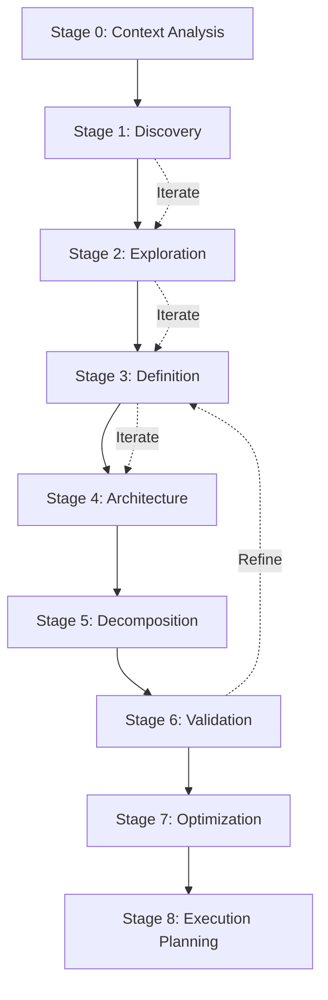

# Multi-Stage Planning Process

## Overview

The Multi-Stage Planning Process (MSPP) extends beyond the current plan-product.md capabilities by introducing a comprehensive, iterative planning workflow that adapts to project complexity and evolves through distinct phases.

## Planning Stages Architecture



## Stage Definitions

### Stage 0: Context Analysis
**Duration**: 5-10 minutes
**Purpose**: Understand project context and determine planning depth

```typescript
interface ContextAnalysis {
  projectType: ProjectType
  complexity: ComplexityLevel
  constraints: Constraint[]
  existingAssets: Asset[]
  teamCapabilities: Capability[]
}

class ContextAnalyzer {
  analyze(initialInput: string): ContextAnalysis {
    return {
      projectType: this.detectProjectType(initialInput),
      complexity: this.assessComplexity(initialInput),
      constraints: this.identifyConstraints(initialInput),
      existingAssets: this.scanExistingAssets(),
      teamCapabilities: this.assessCapabilities()
    }
  }
}
```

**Deliverables**:
- Context assessment report
- Recommended planning depth
- Initial risk assessment

### Stage 1: Discovery
**Duration**: 15-30 minutes
**Purpose**: Gather high-level requirements and vision

```yaml
discovery_activities:
  vision_clarification:
    - product_mission
    - target_audience
    - success_criteria
    - key_differentiators

  constraint_identification:
    - timeline_constraints
    - budget_constraints
    - technical_constraints
    - regulatory_constraints

  stakeholder_mapping:
    - primary_stakeholders
    - decision_makers
    - end_users
    - influencers
```

**Key Questions**:
1. What problem are we solving?
2. For whom are we solving it?
3. How will we measure success?
4. What are the non-negotiables?

**Deliverables**:
- Product vision statement
- Stakeholder map
- Success metrics framework
- Constraint matrix

### Stage 2: Exploration
**Duration**: 30-60 minutes
**Purpose**: Explore solution space and alternatives

```typescript
interface ExplorationPhase {
  solutionAlternatives: Solution[]
  tradeoffAnalysis: TradeOff[]
  riskAssessment: Risk[]
  opportunityMapping: Opportunity[]
}

class SolutionExplorer {
  explore(requirements: Requirements): ExplorationPhase {
    const alternatives = this.generateAlternatives(requirements)
    const tradeoffs = this.analyzeTradeoffs(alternatives)
    const risks = this.assessRisks(alternatives)
    const opportunities = this.identifyOpportunities(alternatives)

    return {
      solutionAlternatives: alternatives,
      tradeoffAnalysis: tradeoffs,
      riskAssessment: risks,
      opportunityMapping: opportunities
    }
  }
}
```

**Activities**:
- Competitive analysis
- Technology evaluation
- Feasibility studies
- Proof of concept planning

**Deliverables**:
- Solution alternatives matrix
- Technology decision record
- Risk register
- Opportunity backlog

### Stage 3: Definition
**Duration**: 45-90 minutes
**Purpose**: Define detailed requirements and specifications

```yaml
definition_components:
  functional_requirements:
    core_features:
      - feature_name
      - description
      - acceptance_criteria
      - priority

    user_stories:
      - as_a
      - i_want
      - so_that
      - acceptance_criteria

  non_functional_requirements:
    performance:
      - response_time
      - throughput
      - scalability

    security:
      - authentication
      - authorization
      - data_protection

    usability:
      - accessibility
      - user_experience
      - documentation
```

**Specification Framework**:
```typescript
class RequirementSpecifier {
  specify(feature: Feature): DetailedSpec {
    return {
      functionalSpec: this.defineFunctional(feature),
      technicalSpec: this.defineTechnical(feature),
      userExperienceSpec: this.defineUX(feature),
      testingSpec: this.defineTests(feature),
      acceptanceCriteria: this.defineAcceptance(feature)
    }
  }
}
```

**Deliverables**:
- Detailed requirements document
- User story map
- Acceptance criteria catalog
- NFR specification

### Stage 4: Architecture
**Duration**: 60-120 minutes
**Purpose**: Design system architecture and technical foundation

```yaml
architecture_planning:
  system_design:
    - component_architecture
    - data_architecture
    - integration_architecture
    - deployment_architecture

  technical_decisions:
    - technology_stack
    - framework_selection
    - database_design
    - api_design

  patterns_and_practices:
    - design_patterns
    - coding_standards
    - testing_strategy
    - deployment_strategy
```

**Architecture Decision Records (ADR)**:
```typescript
interface ADR {
  id: string
  title: string
  status: 'proposed' | 'accepted' | 'rejected'
  context: string
  decision: string
  consequences: string[]
  alternatives: Alternative[]
}

class ArchitectureDesigner {
  designArchitecture(requirements: Requirements): Architecture {
    const decisions = this.makeArchitecturalDecisions(requirements)
    const components = this.designComponents(decisions)
    const integrations = this.planIntegrations(components)

    return {
      decisions,
      components,
      integrations,
      deploymentModel: this.designDeployment(components)
    }
  }
}
```

**Deliverables**:
- System architecture diagram
- Component design documents
- Data model
- Integration architecture
- ADR log

### Stage 5: Decomposition
**Duration**: 45-75 minutes
**Purpose**: Break down into manageable tasks and work packages

```typescript
interface WorkBreakdownStructure {
  epics: Epic[]
  features: Feature[]
  stories: Story[]
  tasks: Task[]
  dependencies: Dependency[]
}

class WorkDecomposer {
  decompose(specifications: Specification[]): WorkBreakdownStructure {
    const epics = this.identifyEpics(specifications)
    const features = this.breakdownToFeatures(epics)
    const stories = this.createUserStories(features)
    const tasks = this.defineTasksz(stories)
    const dependencies = this.mapDependencies(tasks)

    return { epics, features, stories, tasks, dependencies }
  }

  private estimateEffort(task: Task): Estimate {
    return {
      optimistic: this.calculateOptimistic(task),
      realistic: this.calculateRealistic(task),
      pessimistic: this.calculatePessimistic(task),
      weighted: this.calculatePERT(task)
    }
  }
}
```

**Task Sizing Framework**:
```yaml
sizing_categories:
  XS:
    effort: "1-2 hours"
    complexity: "trivial"
    risk: "none"

  S:
    effort: "2-4 hours"
    complexity: "simple"
    risk: "low"

  M:
    effort: "4-8 hours"
    complexity: "moderate"
    risk: "medium"

  L:
    effort: "1-3 days"
    complexity: "complex"
    risk: "medium"

  XL:
    effort: "3-5 days"
    complexity: "very complex"
    risk: "high"

  XXL:
    effort: "1-2 weeks"
    complexity: "extremely complex"
    risk: "very high"
```

**Deliverables**:
- Work breakdown structure
- Task dependency graph
- Effort estimates
- Resource allocation plan

### Stage 6: Validation
**Duration**: 30-45 minutes
**Purpose**: Validate completeness and feasibility

```typescript
interface ValidationChecklist {
  completeness: CompletenessCheck[]
  feasibility: FeasibilityCheck[]
  consistency: ConsistencyCheck[]
  risks: RiskValidation[]
}

class PlanValidator {
  validate(plan: ProjectPlan): ValidationResult {
    const checks = {
      completeness: this.checkCompleteness(plan),
      feasibility: this.checkFeasibility(plan),
      consistency: this.checkConsistency(plan),
      risks: this.validateRisks(plan)
    }

    return {
      isValid: this.allChecksPassed(checks),
      issues: this.collectIssues(checks),
      recommendations: this.generateRecommendations(checks)
    }
  }
}
```

**Validation Criteria**:
```yaml
validation_checks:
  completeness:
    - all_requirements_addressed
    - all_user_stories_defined
    - all_tasks_estimated
    - all_dependencies_mapped

  feasibility:
    - timeline_realistic
    - resources_available
    - technology_proven
    - skills_present

  consistency:
    - requirements_aligned
    - architecture_coherent
    - estimates_reasonable
    - priorities_clear

  risk_coverage:
    - risks_identified
    - mitigations_planned
    - contingencies_defined
    - triggers_established
```

**Deliverables**:
- Validation report
- Issue log
- Risk mitigation plan
- Recommended adjustments

### Stage 7: Optimization
**Duration**: 30-60 minutes
**Purpose**: Optimize plan for efficiency and value delivery

```typescript
class PlanOptimizer {
  optimize(plan: ProjectPlan): OptimizedPlan {
    const criticalPath = this.findCriticalPath(plan)
    const parallelization = this.identifyParallelWork(plan)
    const quickWins = this.findQuickWins(plan)
    const valueStream = this.optimizeValueDelivery(plan)

    return {
      optimizedSchedule: this.resequenceTasks(plan, {
        criticalPath,
        parallelization,
        quickWins,
        valueStream
      }),
      resourceOptimization: this.balanceResources(plan),
      riskOptimization: this.minimizeRiskExposure(plan)
    }
  }
}
```

**Optimization Strategies**:
```yaml
optimization_techniques:
  schedule_optimization:
    - critical_path_compression
    - parallel_execution
    - resource_leveling
    - buffer_management

  value_optimization:
    - mvp_identification
    - incremental_delivery
    - value_stream_mapping
    - waste_elimination

  risk_optimization:
    - risk_based_sequencing
    - early_validation
    - fail_fast_approach
    - contingency_planning
```

**Deliverables**:
- Optimized project schedule
- Resource utilization plan
- Value delivery roadmap
- Risk-adjusted timeline

### Stage 8: Execution Planning
**Duration**: 30-45 minutes
**Purpose**: Create detailed execution plan and handoff

```yaml
execution_planning:
  sprint_planning:
    - sprint_goals
    - sprint_backlog
    - capacity_planning
    - commitment_level

  team_organization:
    - role_assignments
    - responsibility_matrix
    - communication_plan
    - escalation_path

  monitoring_setup:
    - progress_metrics
    - quality_metrics
    - risk_indicators
    - reporting_cadence

  tooling_setup:
    - project_management
    - version_control
    - ci_cd_pipeline
    - monitoring_tools
```

**Execution Framework**:
```typescript
interface ExecutionPlan {
  phases: Phase[]
  milestones: Milestone[]
  deliverySchedule: Schedule
  qualityGates: QualityGate[]
  communicationPlan: CommunicationPlan
}

class ExecutionPlanner {
  planExecution(optimizedPlan: OptimizedPlan): ExecutionPlan {
    return {
      phases: this.definePhases(optimizedPlan),
      milestones: this.setMilestones(optimizedPlan),
      deliverySchedule: this.createSchedule(optimizedPlan),
      qualityGates: this.defineQualityGates(optimizedPlan),
      communicationPlan: this.setupCommunication(optimizedPlan)
    }
  }
}
```

**Deliverables**:
- Execution roadmap
- Sprint plan
- Team charter
- Monitoring dashboard setup
- Handoff documentation

## Stage Transition Criteria

```typescript
interface StageGate {
  stage: PlanningStage
  exitCriteria: Criterion[]
  approvals: Approval[]
  deliverables: Deliverable[]
}

class StageGateManager {
  canTransition(currentStage: PlanningStage): boolean {
    const gate = this.getGateFor(currentStage)

    return (
      this.allCriteriaMet(gate.exitCriteria) &&
      this.allApprovalsReceived(gate.approvals) &&
      this.allDeliverablesComplete(gate.deliverables)
    )
  }
}
```

## Adaptive Planning Modes

### Quick Mode (1-2 hours)
- Stages: 0, 1, 3, 5, 8
- For: Simple projects, MVPs, prototypes

### Standard Mode (3-4 hours)
- Stages: 0, 1, 2, 3, 4, 5, 6, 8
- For: Medium complexity projects

### Comprehensive Mode (6-8 hours)
- All stages with iterations
- For: Complex, critical, or large-scale projects

### Agile Mode (Iterative)
- Cycle through stages 3-5-6-7
- For: Evolving requirements, exploratory projects

## Integration with Agent OS

```yaml
agent_integration:
  context_fetcher:
    - retrieve_existing_plans
    - gather_organizational_standards
    - fetch_similar_projects

  file_creator:
    - create_planning_artifacts
    - maintain_planning_log
    - generate_documentation

  project_manager:
    - coordinate_planning_stages
    - track_planning_progress
    - manage_stakeholder_input

  task_executor:
    - execute_planning_tasks
    - run_validation_checks
    - generate_reports
```

## Planning Metrics and KPIs

```typescript
interface PlanningMetrics {
  efficiency: {
    planningDuration: number
    revisionsRequired: number
    completenessScore: number
  }

  quality: {
    requirementClarity: number
    architectureRobustness: number
    riskCoverage: number
  }

  execution: {
    planAccuracy: number
    scheduleVariance: number
    scopeCreep: number
  }
}
```

## Continuous Improvement

```yaml
improvement_cycle:
  capture:
    - planning_decisions
    - actual_outcomes
    - lessons_learned

  analyze:
    - variance_analysis
    - root_cause_analysis
    - pattern_recognition

  improve:
    - update_templates
    - refine_algorithms
    - enhance_questions

  share:
    - update_knowledge_base
    - train_ml_models
    - distribute_learnings
```